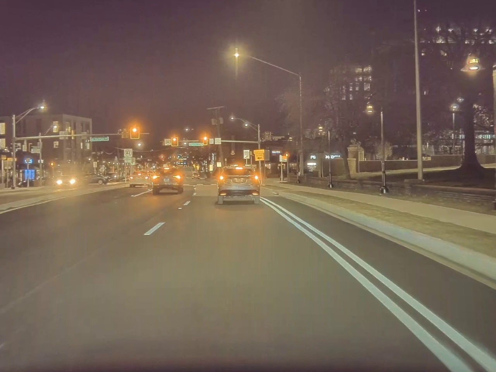
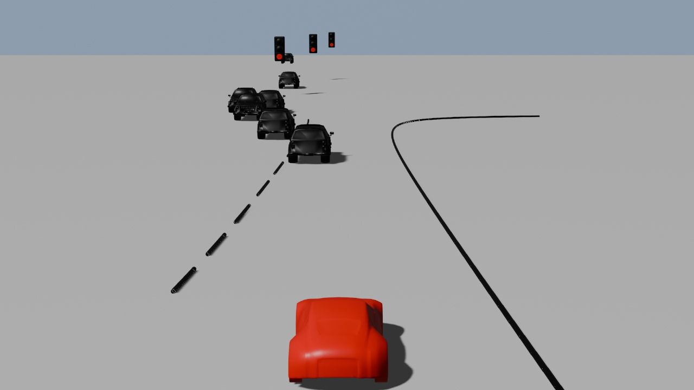
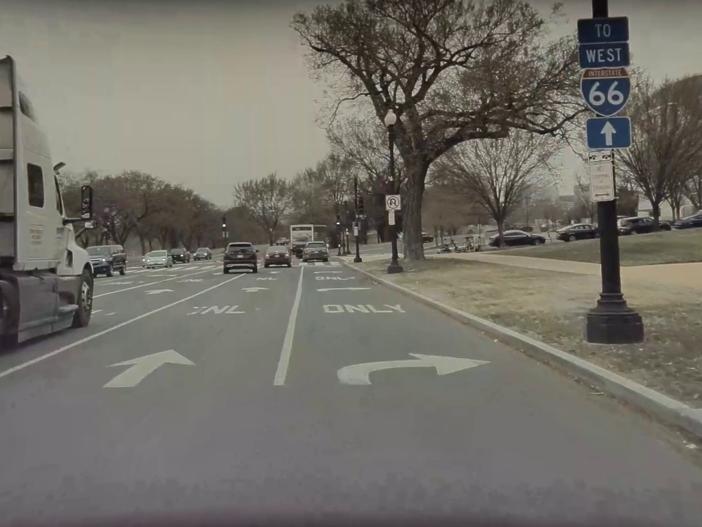
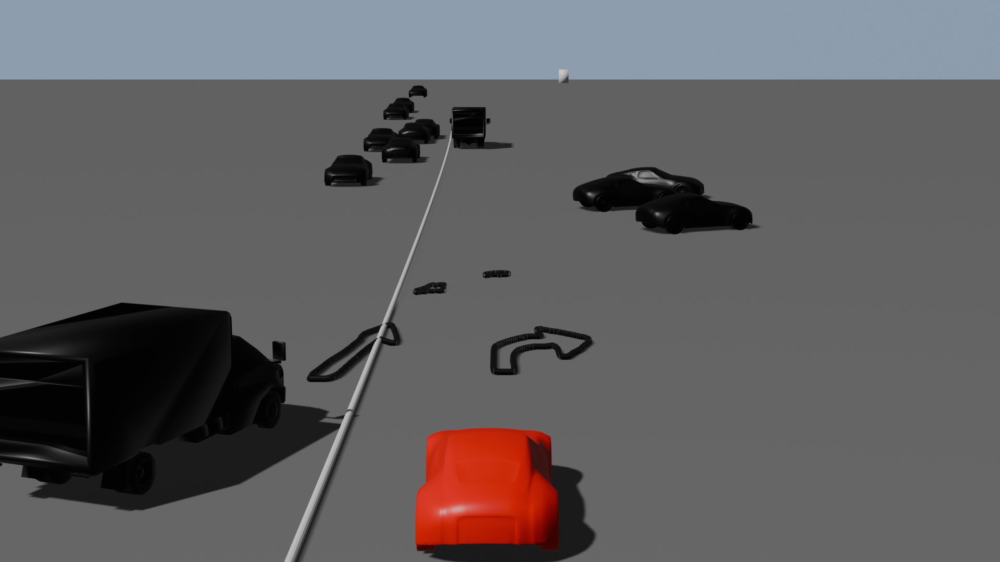

# Road-Traffic-Object-Detection-and-Visualization

This repository contains code for 3D scene visualization of road traffic for Autonomous Vehicles. It includes modules for Lane Detection, Vehicle and Pedestrian Pose Estimation, and Object Detection.

## Overview

This project aims to enhance autonomous vehicle perception by providing accurate detection and visualization of various road elements. The key features include lane detection, vehicle and pedestrian pose estimation, and object detection, which are crucial for understanding and navigating complex traffic scenarios.

## Demo

<div style="display: flex; justify-content: space-around;">
  
  
</div>

Here’s a brief animation showcasing the functionality of the project. Feel free to watch the demo to get an idea of how it works.

## Presentation


This slide provides an overview of the project and its key components. You can use it to understand the core concepts and objectives.

## Results

### Lane Detection
- **Description:** The lane detection algorithm identifies and highlights lane markings in road scenes.
- **Images:**
  <div style="display: flex; justify-content: space-between;">
    
    
 
- **Observations:** Discuss accuracy in different conditions and any challenges encountered.

### Arrow Detection
- **Description:** This module detects road arrows to aid in understanding road directions.
- **Images:**
  <div style="display: flex; justify-content: space-between;">
    
    
  </div>
- **Observations:** Comment on the algorithm’s effectiveness in diverse scenarios.

### Vehicle Pose and Type Detection
- **Description:** Results for detecting vehicle pose and type, including orientation and classification.
- **Images:**
  <div style="display: flex; justify-content: space-between;">
    
    
  </div>
- **Observations:** Include insights on detection accuracy and any issues with vehicle classification.

### Pedestrian Pose Detection
- **Description:** Visualization of pedestrian poses detected within various scenes.
- **Images:**
  <div style="display: flex; justify-content: space-between;">
    
    
  </div>
- **Observations:** Evaluate the performance of the pose detection in different environments.

### Object Detection
- **Description:** Demonstrates the object detection capabilities for identifying and classifying objects in road scenes.
- **Images:**
  <div style="display: flex; justify-content: space-between;">
    
    
  </div>
- **Observations:** Discuss detection performance, including accuracy and types of objects detected.

## Installation

To set up the project locally, follow these instructions:

1. Clone the repository
2. Install dependencies
3. Run the application

```bash
# Clone the repository
git clone https://github.com/your-username/your-repo.git

# Navigate into the project directory
cd your-repo

# Install dependencies
pip install -r requirements.txt

# Run the project
python your-script.py
```

