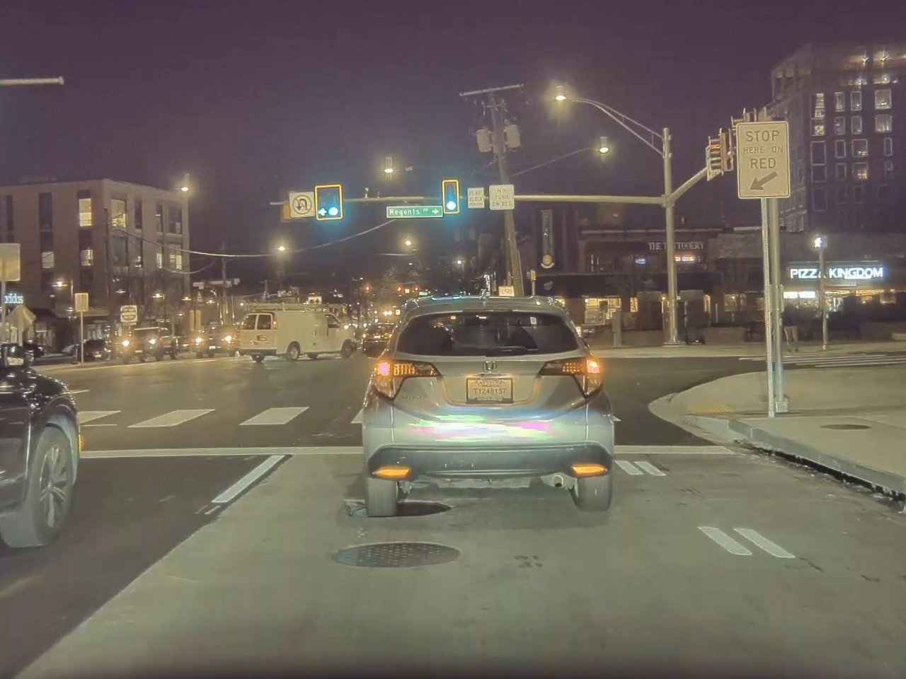
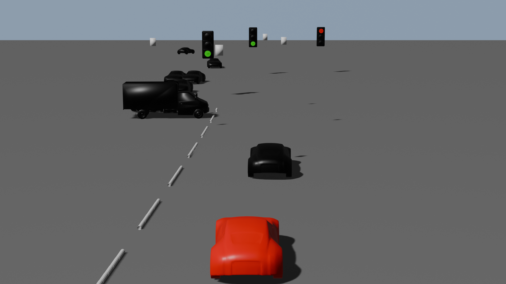
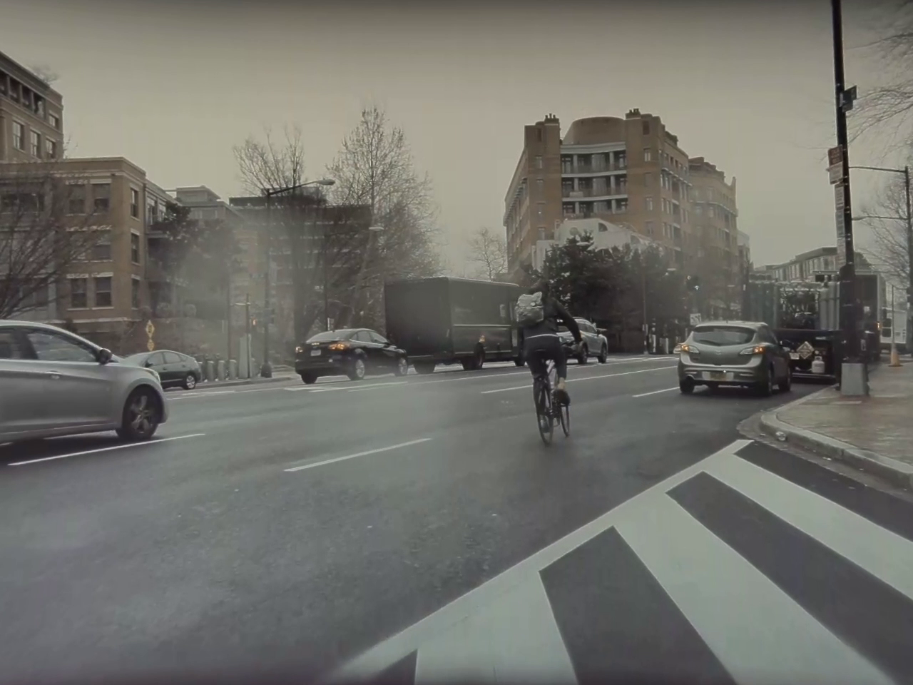
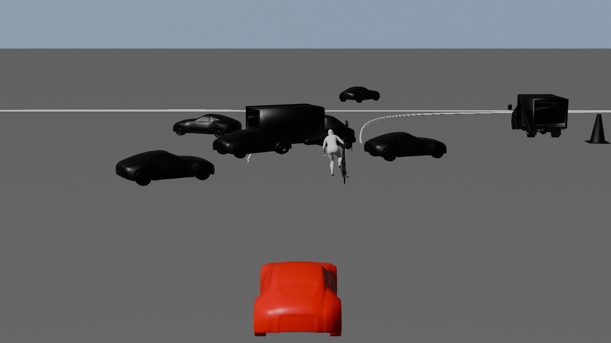
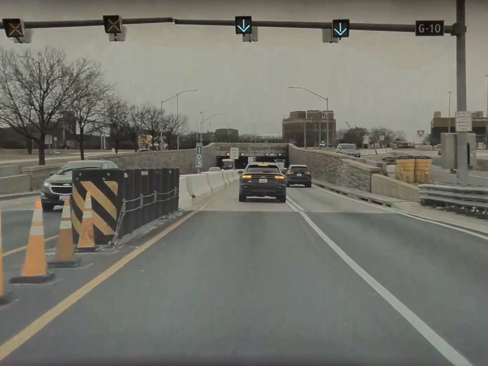
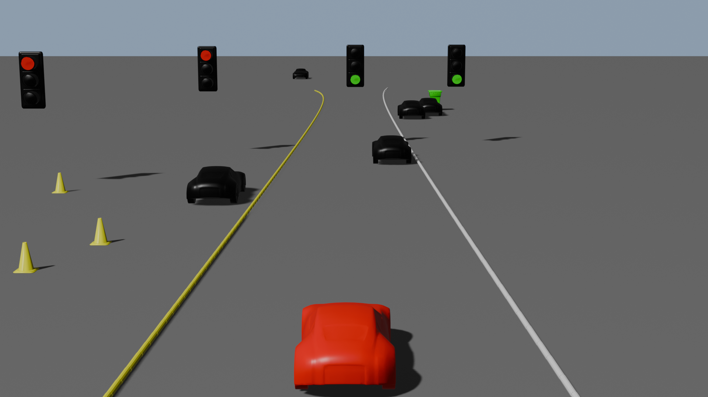
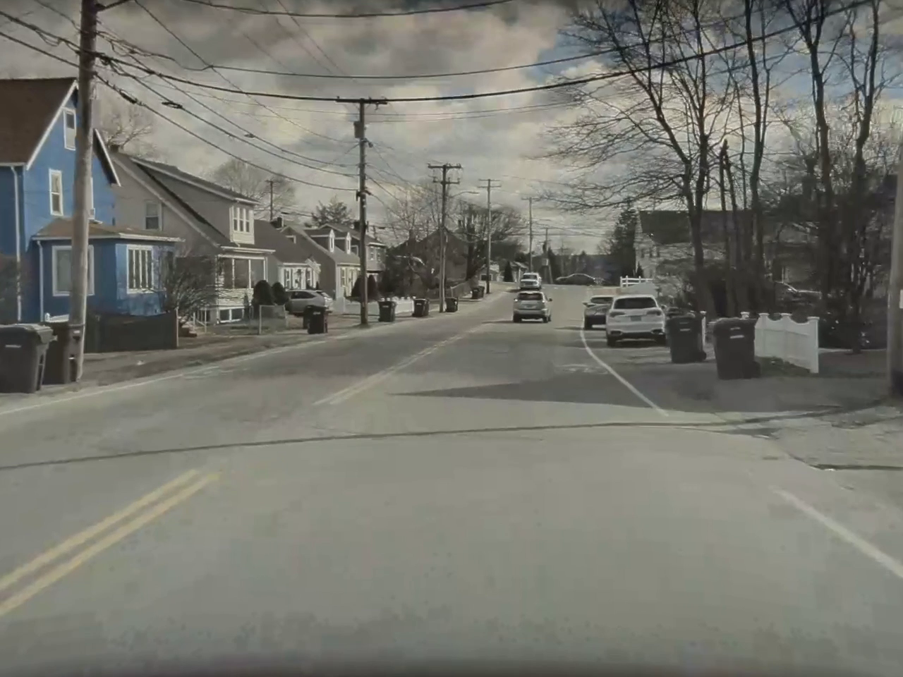
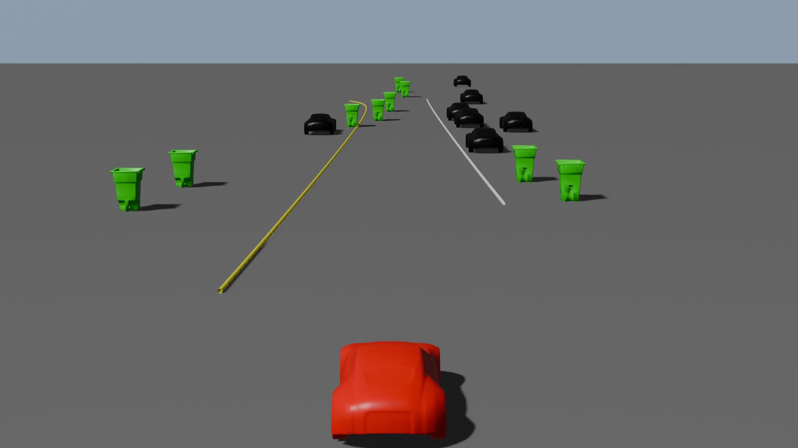
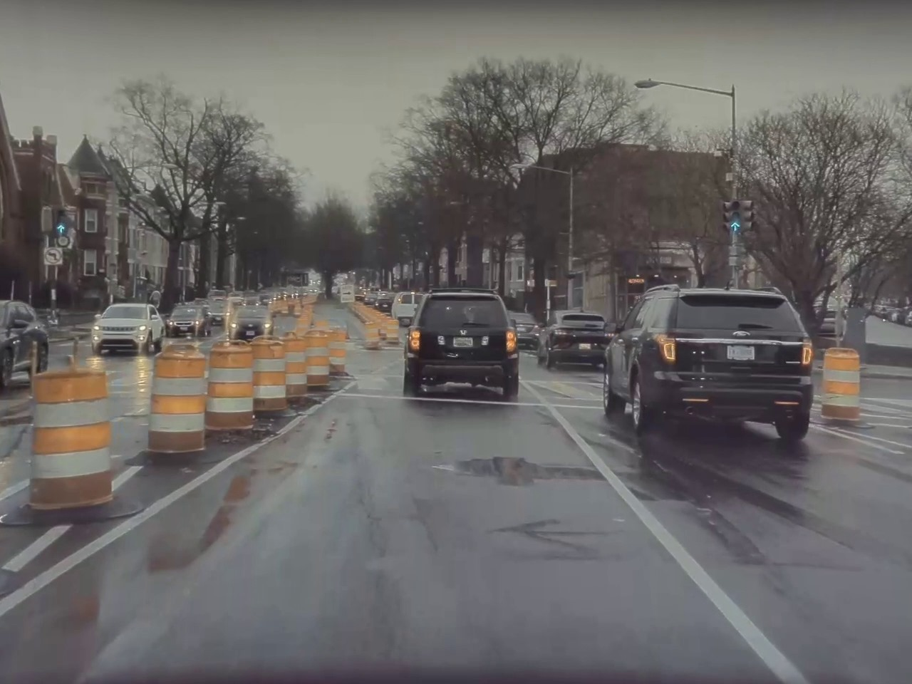
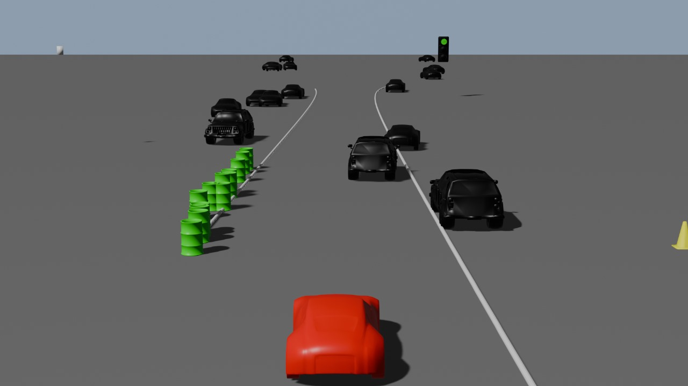

# Road-Traffic-Object-Detection-and-Visualization

This repository contains code for 3D scene visualization of road traffic for Autonomous Vehicles. It includes modules for Lane Detection, Vehicle and Pedestrian Pose Estimation, and Object Detection.

## Overview

This project aims to enhance autonomous vehicle perception by providing accurate detection and visualization of various road elements. The key features include lane detection, vehicle and pedestrian pose estimation, and object detection, which are crucial for understanding and navigating complex traffic scenarios.

## Demo

  
  

Here’s a brief animation showcasing the functionality of the project. Feel free to watch the demo to get an idea of how it works.

## Results

### Lane Detection
- **Description:** The lane detection algorithm identifies and highlights lane markings in road scenes.
- **Images:**
  

    
    
 
  ### Arrow Detection
- **Description:** This module detects road arrows to aid in understanding road directions.
- **Images:**
  

    
    
  

### Vehicle Pose Detection
- **Description:** Results for detecting vehicle pose.
- **Images:**
  

    
    
  

- **Observations:** Include insights on detection accuracy and any issues with vehicle classification.

- ### Type Detection
- **Description:** Results for detecting vehicle type.
- **Images:**
  

    
    
  

- **Observations:** Include insights on detection accuracy and any issues with vehicle classification.

### Pedestrian Pose Detection
- **Description:** Visualization of pedestrian poses detected within various scenes.
- **Images:**
  

    
    
  

### Object Detection
- **Description:** Demonstrates the object detection capabilities for identifying and classifying objects in road scenes.
- **Images:**
  

    
    
  

  

    
    
  

  

    
    
  

